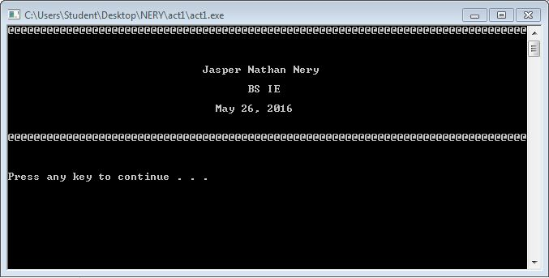

# Activity1-NeryJ

```
#include <stdio.h>
#include <stdlib.h>

int main()
{
	puts("@@@@@@@@@@@@@@@@@@@@@@@@@@@@@@@@@@@@@@@@@@@@@@@@@@@@@@@@@@@@@@@@@@@@@@@@@@@@@@@@\n \n");
	puts("                              Jasper Nathan Nery                                ");
	puts("                                     BS IE                                      ");
	puts("		            	May 26, 2016                                  \n \n");
	puts("@@@@@@@@@@@@@@@@@@@@@@@@@@@@@@@@@@@@@@@@@@@@@@@@@@@@@@@@@@@@@@@@@@@@@@@@@@@@@@@@\n \n");
	system("PAUSE");
}
```


```
#include <stdlib.h>
#include <stdio.h>

int main()
{
	float b,h,area;
	printf("Input Triangle's base:");
	scanf("%f",&b);
	printf("Input Triangle's height:");
	scanf("%f",&h);
	area = b*h;
	printf("%1f \n", area);
	system("PAUSE");
	
}
```


```
#include <stdlib.h>
#include <stdio.h>

int main()
{
	int yr,age;
	printf("Input birth year:");
	scanf("%i",&yr);
	age=2016-yr;
	printf("Your age now is: %i years old", age);
	
}
```


```
#include <stdlib.h>
#include <stdio.h>

int main()
{
	float xval,fx;
	printf("Input value of x:");
	scanf("%f",&xval);
	fx=xval/70;
	printf("The value of f(x)= %f", fx);
	
}
```
)
